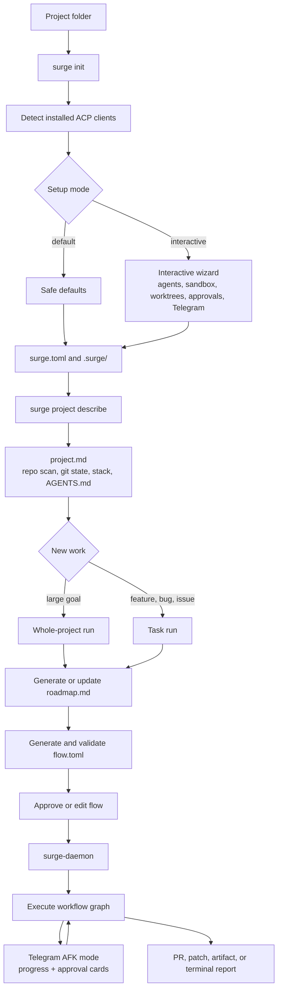
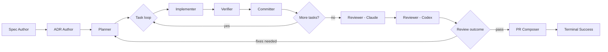
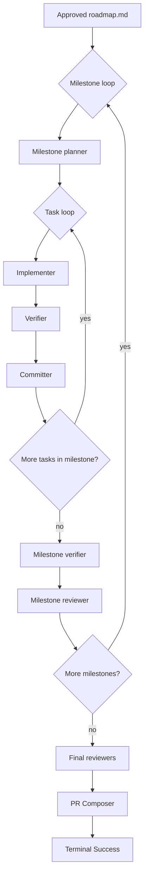
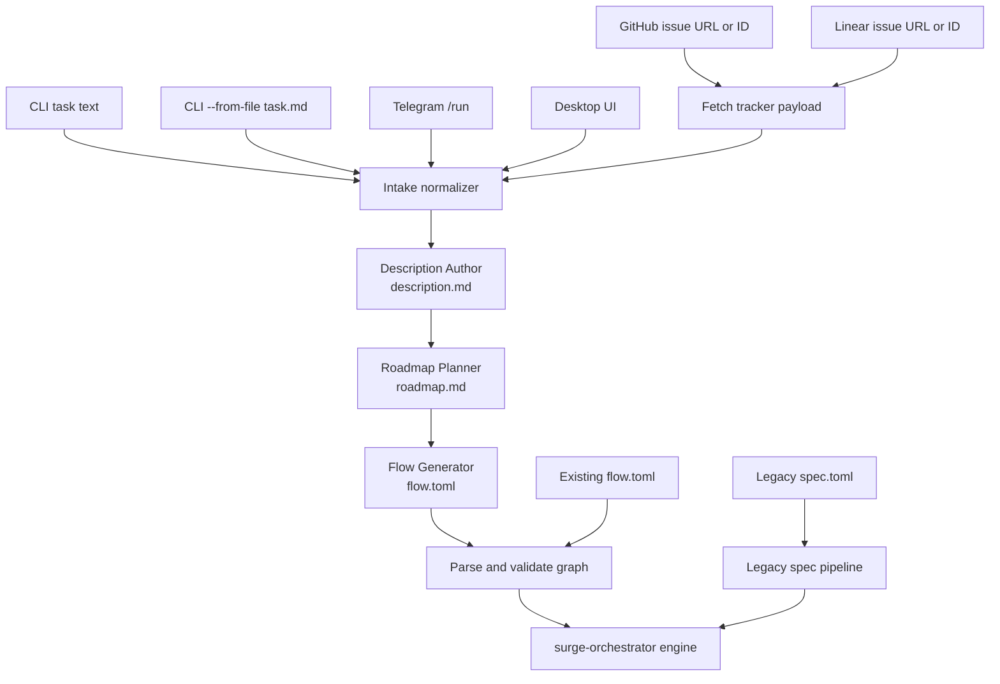
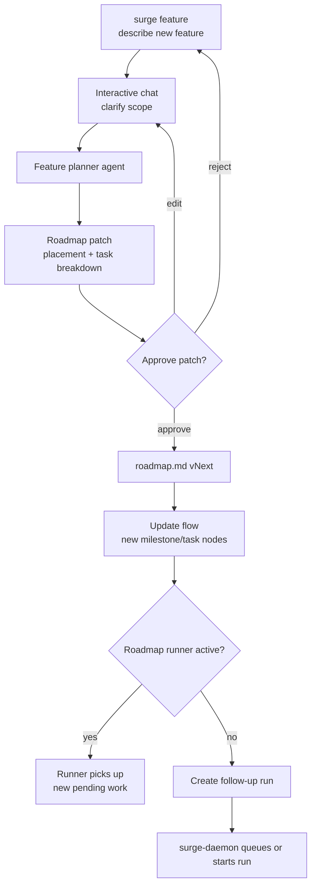
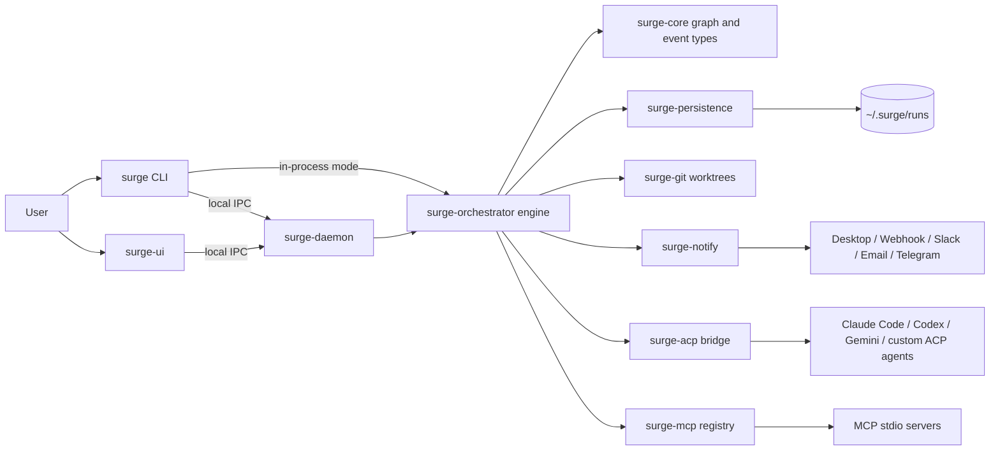
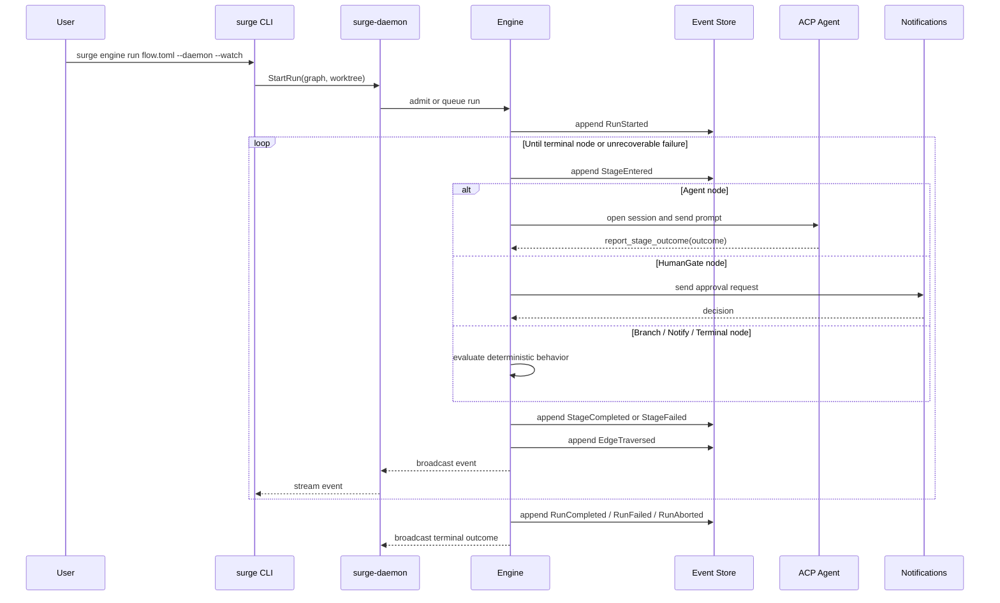

# Surge

[](https://github.com/vanyastaff/surge/actions)

**Local-first orchestration for AFK AI coding workflows.**

Surge is a Rust workspace for running long AI coding work as explicit,
event-sourced workflow graphs. A run is not one giant prompt and not a swarm of
agents negotiating with each other. A run is a `flow.toml`: typed nodes,
declared outcomes, and edges. Agents do the work inside bounded stages; the
graph decides where execution goes next.

The target experience is:

```text
initialize project -> describe work -> approve roadmap/flow -> walk away -> return to a PR
```

The current repository already contains the lower-level engine, ACP bridge,
persistence, daemon, CLI, notification, MCP, and desktop UI pieces. The full
polished AFK product loop is still pre-release and is documented in
[`docs/revision`](docs/revision/README.md).

## Status

Surge is **pre-release software**. Treat it as an active development workspace,
not a stable end-user product.

Current implementation:

- `surge-core` - graph, profile, event, sandbox, approval, and validation types.
- `surge-acp` - ACP client/pool/bridge, agent registry, discovery, health,
  mock ACP agent.
- `surge-orchestrator` - legacy spec pipeline plus the newer graph engine.
- `surge-persistence` - SQLite-backed run storage, event logs, views, memory,
  and analytics.
- `surge-daemon` - long-running local engine host over Unix sockets / Windows
  named pipes.
- `surge-cli` - agents, specs, git worktrees, graph engine, daemon, registry,
  memory, insights, analytics.
- `surge-notify` - desktop, webhook, Slack, email, and Telegram delivery
  backends.
- `surge-mcp` - stdio MCP server lifecycle and tool delegation, currently wired
  at the library/engine level rather than through a user-facing config file.
- `surge-ui` - GPUI desktop shell under development.

Documentation convention in this README:

- **Current** means implemented enough to try from the repository.
- **Target** means product direction from `docs/revision`; command names may
  still change while the CLI is being aligned.

## Target AFK Workflow

Surge is project-first. A user creates or opens a project folder, runs
`surge init`, lets Surge detect available ACP clients, chooses default or
interactive setup, then runs whole-project or task-level work. The daemon owns
execution and Telegram/UI are monitoring and approval surfaces.



The AFK part is explicit: the local machine keeps executing while the user only
handles strategic decisions, such as approving generated plans, granting a
permission, answering a HumanGate, or reviewing the final PR.

## Flow Model

A `flow.toml` is a workflow graph. Each node is a bounded stage with its own:

- role/profile
- provider/client: Claude, Codex, Gemini, Copilot, or custom ACP
- sandbox intent and tool access
- input bindings from prior artifacts
- retry and timeout policy
- declared outcomes

Each Agent node runs in a **SMART Zone**:

- **Scope** - what this node owns.
- **Model** - which ACP client/provider runs it.
- **Access** - sandbox intent, MCP tools, filesystem/network policy.
- **Runtime context** - project description, roadmap item, prior artifacts,
  selected files, graph metadata.
- **Termination contract** - the node must report a declared outcome.

Agents understand the local flow context and choose an outcome, but routing is
still graph data. If a step needs judgment, that judgment is modeled as outcome
ports such as `pass`, `fixes_needed`, `architecture_issue`, `security_blocker`,
or `escalate`.

### Example Feature Flow



This is one possible medium feature flow. The Flow Generator can add or remove
nodes based on risk, scope, project type, and available profiles.

### Roadmap Flow

For a roadmap-driven run, the graph can contain nested loops: an outer loop over
milestones and an inner loop over tasks inside the active milestone.



Each loop body is still made of normal nodes with normal outcomes. A verifier
can route back to implementation for a local fix. A milestone reviewer can
route back to planning if the milestone is structurally wrong. Final reviewers
can route back before PR creation.

## Intake Sources

All incoming work should be normalized before bootstrap. A GitHub issue or
Linear issue is not a special pipeline type; it is another source of task text
and metadata.



Current practical paths:

- `surge engine run <flow.toml>` starts from an already-authored graph.
- `surge run <spec_id>` uses the older spec pipeline.

Target paths:

- CLI/Telegram/UI natural-language work enters the bootstrap path.
- GitHub Issues and Linear issues are fetched, normalized, and fed into the same
  bootstrap path.

## Roadmap Amendments

Roadmaps are not frozen documents. After roadmap approval, the user can add a
feature through a target `surge feature` flow. The feature planner proposes a
patch: where to insert the feature and how to expand it into milestone/tasks.



If a roadmap runner is active, the daemon can emit a roadmap-updated event and
the runner sees the new pending milestone/tasks. If the roadmap is already
terminal, or roadmap-flow execution is disabled, Surge appends the feature and
creates a follow-up run instead of mutating completed execution history.

## Runtime Architecture



The daemon is the local coordinator. It accepts work from CLI, Telegram, UI, and
eventually external trackers, then starts or queues runs. Progress and approval
state are derived from the event log, so Telegram messages and the desktop UI
render the same underlying state.

## Run Lifecycle



Every state transition is persisted first and rendered later. Replaying a run is
a fold over the event stream.

## Repository Layout

```text
surge/
|-- crates/
|   |-- surge-core/          # Core graph, event, profile, config, validation types
|   |-- surge-acp/           # ACP integration, agent pool, bridge, registry
|   |-- surge-spec/          # Legacy TOML spec format and validation
|   |-- surge-git/           # Git worktree and branch lifecycle
|   |-- surge-persistence/   # SQLite/event-log storage, analytics, memory
|   |-- surge-orchestrator/  # Legacy pipeline and new graph execution engine
|   |-- surge-cli/           # `surge` CLI binary
|   |-- surge-daemon/        # Long-running local engine process
|   |-- surge-ui/            # GPUI desktop application
|   |-- surge-notify/        # Notification delivery backends
|   `-- surge-mcp/           # MCP stdio server lifecycle and tool calls
|-- docs/
|   |-- revision/            # Active product specification and roadmap
|   |-- superpowers/         # Implementation specs/plans for recent milestones
|   `-- *.md                 # Legacy/background docs
|-- examples/
|   |-- flow_terminal_only.toml
|   `-- flow_minimal_agent.toml
|-- surge.example.toml       # Example project config
`-- Cargo.toml               # Rust workspace
```

## Quick Start

Requirements:

- Rust `1.85+`
- Git
- An ACP-compatible agent on `PATH` for flows that contain `Agent` nodes

Build the core workspace:

```bash
cargo build --workspace --exclude surge-ui
```

The desktop UI is optional and has separate GPUI dependencies:

```bash
cargo build -p surge-ui
```

Run the smallest graph. This flow contains only a terminal node, so it does not
need an agent:

```bash
cargo run -p surge-cli --bin surge -- engine run examples/flow_terminal_only.toml --watch
```

Run the same flow through the daemon:

```bash
cargo run -p surge-cli --bin surge -- daemon start --detached
cargo run -p surge-cli --bin surge -- engine run examples/flow_terminal_only.toml --daemon --watch
cargo run -p surge-cli --bin surge -- engine ls --daemon
cargo run -p surge-cli --bin surge -- daemon stop
```

Configure agents in a project:

```bash
cargo run -p surge-cli --bin surge -- init
cargo run -p surge-cli --bin surge -- registry list
cargo run -p surge-cli --bin surge -- registry detect
cargo run -p surge-cli --bin surge -- agent list
```

Then edit `surge.toml` or use registry commands to add an ACP agent. The sample
config in [`surge.example.toml`](surge.example.toml) shows local, `npx`, custom,
TCP, and MCP-flavored agent entries.

Smoke-test an agent:

```bash
cargo run -p surge-cli --bin surge -- ping --agent claude
cargo run -p surge-cli --bin surge -- prompt "Summarize this repository" --agent claude
```

Run the minimal agent graph once an ACP agent is available:

```bash
cargo run -p surge-cli --bin surge -- engine run examples/flow_minimal_agent.toml --watch
```

## CLI Surface

Current command groups:

```text
surge init              create project-level surge.toml
surge agent ...         manage configured agents
surge registry ...      inspect built-in/remote ACP agent registry
surge spec ...          manage legacy specs
surge run ...           execute the legacy spec pipeline
surge engine ...        execute flow.toml graphs
surge daemon ...        manage the long-running local engine host
surge clean             clean up orphaned worktrees and merged branches
surge worktrees         list active worktrees
surge analytics ...     view token/cost analytics
```

There are two execution surfaces today:

- `surge spec ...` + `surge run <spec_id>` is the older structured-spec
  pipeline. It creates static task plans from templates and runs them through
  planner/coder/reviewer-style stages.
- `surge engine run <flow.toml>` is the newer graph engine path. It runs an
  already-authored workflow graph with explicit nodes, outcomes, and edges.

Current-to-target mapping:

| Product intent | Current closest command | Gap |
| --- | --- | --- |
| Initialize a project | `surge init`, then `surge registry detect`, `surge registry add`, or `surge agent add` | `init` is not an interactive wizard yet; sandbox, worktree, approvals, and notification choices are separate/manual. |
| Describe or refresh project context | `surge memory add` and `surge memory search` | No `surge project describe` command yet; repo scanning and stable project context generation are target behavior. |
| Create a focused feature/task run | `surge spec create "..." --template feature`, then `surge plan <id>` or `surge run <id>` | Uses static legacy templates, not adaptive flow generation. |
| Run a full roadmap/flow | Manually create `flow.toml`, then `surge engine run <flow.toml> --watch` | No command yet that generates roadmap, milestones, tasks, and flow from a project goal. |
| Amend an existing roadmap with a new feature | Create another spec with `surge spec create ...` or edit roadmap/flow files manually | No `surge feature` command yet that inserts work into a roadmap and wakes the runner. |
| Run AFK through a daemon | `surge daemon start` and `surge engine run <flow.toml> --daemon --watch` | Daemon exists; full Telegram approval bot and tracker intake loop are still target UX. |
| Start from GitHub Issues or Linear | No direct CLI equivalent | GitHub/Linear issue intake should normalize tracker payloads into the same bootstrap path, but this is not a user-facing command yet. |

Current `surge spec create` templates are `feature`, `bugfix`, `refactor`,
`performance`, `security`, `docs`, and `migration`.

Target command ideas from the product model:

```text
surge project describe  create or refresh stable project context
surge task ...          create a focused task run
surge feature ...       amend roadmap with a new feature
```

## Documentation

Start here:

- [`docs/revision/README.md`](docs/revision/README.md) - active spec index
- [`docs/revision/rfcs/0001-overview.md`](docs/revision/rfcs/0001-overview.md) -
  vision, scope, non-goals, glossary
- [`docs/revision/rfcs/0002-execution-model.md`](docs/revision/rfcs/0002-execution-model.md) -
  event sourcing, run lifecycle, replay, crash recovery
- [`docs/revision/rfcs/0003-graph-model.md`](docs/revision/rfcs/0003-graph-model.md) -
  nodes, outcomes, edges, validation
- [`docs/revision/rfcs/0004-bootstrap-and-flow-generation.md`](docs/revision/rfcs/0004-bootstrap-and-flow-generation.md) -
  target bootstrap and adaptive flow generation
- [`docs/revision/rfcs/0005-profiles-and-roles.md`](docs/revision/rfcs/0005-profiles-and-roles.md) -
  reusable agent profiles
- [`docs/revision/rfcs/0006-sandbox-and-approvals.md`](docs/revision/rfcs/0006-sandbox-and-approvals.md) -
  agent-native sandbox intent and approval policy
- [`docs/revision/rfcs/0007-telegram-bot.md`](docs/revision/rfcs/0007-telegram-bot.md) -
  target mobile approval UX
- [`docs/revision/rfcs/0008-ui-architecture.md`](docs/revision/rfcs/0008-ui-architecture.md) -
  editor/runtime/replay UI direction
- [`docs/revision/ROADMAP.md`](docs/revision/ROADMAP.md) - milestone roadmap

Crate-level docs worth reading:

- [`crates/surge-daemon/README.md`](crates/surge-daemon/README.md)
- [`crates/surge-mcp/README.md`](crates/surge-mcp/README.md)
- [`crates/surge-notify/README.md`](crates/surge-notify/README.md)

## Development

Common checks:

```bash
cargo fmt --check
cargo test --workspace --exclude surge-ui
cargo clippy -p surge-core --all-targets --all-features -- -D warnings
cargo clippy -p surge-acp --all-targets -- -D warnings
cargo clippy --workspace --all-targets --all-features
```

Long-running or external-agent engine tests are separated:

```bash
cargo build -p surge-acp --bin mock_acp_agent
cargo test -p surge-orchestrator --tests -- --ignored
```

Local runtime state is stored under `~/.surge/`, including run databases and
daemon metadata. Project-local state may appear under `.surge/`.

## License

Licensed under either of:

- Apache License, Version 2.0 ([LICENSE-APACHE](LICENSE-APACHE))
- MIT License ([LICENSE-MIT](LICENSE-MIT))

at your option.
