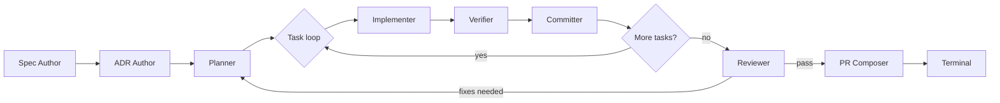
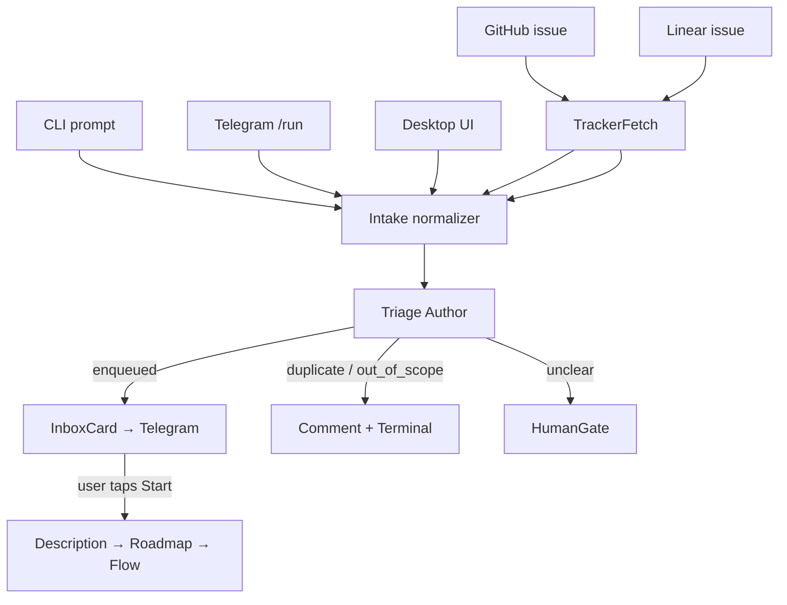

[← Workflow](workflow.md) · [Back to README](../README.md) · [Development →](development.md)

# Surge Architecture

> **Status:** living document. Architecture is described from the existing codebase; product vision and explicit decisions are still being written. Treat any section marked _(intent)_ as a sketch, not a contract.

## 1. Positioning

Surge is a **local-first meta-orchestrator for AFK AI coding**, written in Rust.

The reference point is [sandcastle][sc]: a TypeScript SDK that wraps a coding agent inside a sandbox provider (Docker / Podman / Vercel) and runs it AFK with a `sandcastle.run()` call, handling git branches and auto-merge.

Surge keeps that spirit — **describe → walk away → return to a PR** — and pushes it further:

| Concern | sandcastle | surge |
|---|---|---|
| Language | TypeScript | Rust |
| Agent runtime | wraps provider directly | speaks **ACP** to any conformant agent (Claude Code, Codex, Gemini, custom) |
| Sandbox | provider-supplied (Docker/Podman/Vercel) | **delegated to the agent runtime** (Codex CLI sandbox, Claude Code skills, etc.); surge never reimplements OS isolation |
| Workflow | imperative loop / template | declarative `flow.toml` graph with typed outcomes and edges |
| State | per-run, in-memory-ish | append-only event log → replay, time-travel, fork-from-here |
| Approvals | exit codes / callbacks | first-class **Telegram** approval cards; desktop / email fallback |
| Source of work | CLI prompt | CLI · Telegram · UI · GitHub Issues · Linear (one normalized intake path) |

The differentiator is **agent-agnostic + source-agnostic + sandbox-delegated**. Coding agents themselves are moving into clouds (Claude Code Cloud, Codex App Server). The new layer above them is orchestration / intake / governance / replay. That is where surge sits.

[sc]: https://github.com/mattpocock/sandcastle

## 2. Core principles

1. **Engine is dumb, agents are smart.** Routing decisions are graph data (declarative edges keyed by outcome). The LLM only does the work; it never decides "what to do next" — that is the graph's job.
2. **Sandbox is delegated.** surge configures the agent runtime's native sandbox (modes like `read-only`, `workspace-write`, `workspace+network`, `full-access`) and observes elevation requests. No Landlock / sandbox-exec / AppContainer code in this tree.
3. **Event-sourced.** Every state transition is appended to a per-run log first, rendered later. Replay, fork, and crash recovery are folds over that log, not extra subsystems.
4. **Adaptive complexity.** Trivial bug fix → 3 nodes linear. Large project → outer milestone loop with nested task loops. The Flow Generator picks structure per run; the user never selects a "tier".
5. **Local-first.** Long-running daemon on the user's machine. Cloud deployments are not the primary form factor.
6. **Open source.** MIT/Apache-2.0, no telemetry, no CLA.

## 3. Workflow model — `flow.toml`

A run is a graph defined in `flow.toml`. Each node is a bounded stage; edges route declared outcomes to the next node.

### NodeKind (closed enum)

| Kind | Purpose |
|---|---|
| `Agent` | LLM work via ACP. Has profile, sandbox intent, declared outcomes. |
| `HumanGate` | Pause for an approval (Telegram / desktop). |
| `Branch` | Deterministic predicate routing — no LLM. |
| `Loop` | Iterate a body subgraph over a collection (tasks, milestones, files). |
| `Subgraph` | Compose a named sub-flow. |
| `Notify` | Async side-effect (post a message, write a comment). |
| `Terminal` | End state: `success`, `failure`, `aborted`. |

The enum is **closed**. Extensibility happens via profiles, named agents, and templates — not new node kinds.

### Outcomes and edges

An `Agent` node declares outcomes (`pass`, `fixes_needed`, `architecture_issue`, `escalate`, …). Each outcome is a typed output port; an `Edge` connects exactly one outcome to exactly one downstream `NodeId`. Routing is therefore a property of the graph, not of the prompt.

Edges have a `kind`: `Forward`, `Backtrack`, or `Escalate`. Loops form valid cycles via `Backtrack`.

### Validation invariants

- All non-terminal nodes are reachable from `start`.
- At least one `Terminal` is reachable from every non-terminal node (no dead ends, no infinite loops without an escape).
- Every declared outcome has at most one outgoing edge; every edge references a declared outcome on a real node.
- Profile / template / named-agent references resolve before execution.

### Example feature flow



For roadmap-driven runs, the outer `Loop` is "milestones" and the inner `Loop` is "tasks within the active milestone".

## 4. Engine — event sourcing & lifecycle

The engine is a deterministic state machine. The current state of a run is the **fold** of its event log; nothing else is authoritative.

### Run state

```
NotStarted → Bootstrapping → Pipeline → Terminal
```

### Event types (selected)

`RunStarted`, `BootstrapStageStarted`, `StageEntered`, `ToolCalled`, `ToolReturned`, `OutcomeReported`, `StageCompleted`, `StageFailed`, `EdgeTraversed`, `ApprovalRequested`, `ApprovalDecided`, `SandboxElevationRequested`, `TokensConsumed`, `RunCompleted`, `RunFailed`, `RunAborted`.

Each event has a per-run monotonic `seq`, a timestamp, and a typed payload. Folding is **deterministic**: no wall-clock dependencies, no random IDs introduced during fold.

### Per-node execution

| Kind | Behaviour |
|---|---|
| `Agent` | resolve bindings → open ACP session → inject tools → drive session → run hooks → validate outcome → close session → route by outcome. |
| `HumanGate` | render summary → emit `ApprovalRequested` → wait for `ApprovalDecided` → route. |
| `Branch` | evaluate predicates synchronously → route. |
| `Loop` | iterate items, enter body subgraph per iteration, accumulate outcomes. |
| `Notify` | side-effect, no routing decision. |
| `Terminal` | append `RunCompleted` / `RunFailed` / `RunAborted`, exit. |

### Replay, fork, crash recovery

- **Replay** = fold the events up to seq `N` and render the canvas / detail panel at that point.
- **Fork-from-here** = copy events `1..N` into a new run, create a new git worktree at the same commit, start executing forward with optional pre-fork edits (prompt override, profile change).
- **Crash recovery** = on daemon restart, scan non-terminal runs, fold each, decide per-stage what to retry / which approvals to re-emit.

### Hooks

`pre_tool_use`, `post_tool_use`, `on_outcome`, `on_error`. Hooks may **reject** an outcome and force a retry, or **suppress** a stage failure into a declared outcome. This is where deterministic verification lives without changing the approval design.

See [`docs/hooks.md`](hooks.md) for the full lifecycle, matcher rules, failure-mode matrix, suppression directive format, and a profile-authoring example.

## 5. ACP bridge — agent integration

The ACP bridge runs on a **dedicated OS thread** with its own single-threaded Tokio runtime + `LocalSet`, because the [Agent Client Protocol][acp] SDK uses `!Send` futures.

[acp]: https://agentclientprotocol.com

> Why ACP and only ACP — see [ADR-0006](adr/0006-acp-only-transport.md).

### Channel-based IPC

The engine talks to the bridge via an mpsc `BridgeCommand` channel and listens to a broadcast `BridgeEvent` stream:

```
engine ──BridgeCommand──▶ bridge ──spawn_local──▶ ACP session ──▶ agent runtime
engine ◀───BridgeEvent── bridge ◀── observer ◀───────────────────
```

Commands: `OpenSession`, `SendMessage`, `CloseSession`. Events: `SessionEstablished`, `ToolCall`, `ToolResult`, `PermissionRequest`, `AgentMessageChunk`, `TokensConsumed`, `SessionEnded`.

### Injected tools

Two surge-controlled tools are exposed to every agent session:

- **`report_stage_outcome`** — the only sanctioned way for an agent to terminate a stage. The tool's enum is **dynamic per node**: it carries the outcomes declared on that specific node, so the model cannot return an outcome the graph cannot route.
- **`request_human_input`** — escalate mid-stage when the agent needs a strategic decision the prompt did not anticipate.

Provider-native tools (file edits, terminal, web fetch, MCP tools) execute under the agent runtime's own sandbox; surge sees them as `ToolCall` / `ToolResult` events but does not enforce them.

### Sandbox delegation

Each `Agent` node carries a launch profile (`provider-default`, `local`, `cloud`, `sandbox`) and a sandbox intent (`read-only`, `workspace-write`, `workspace+network`, `full-access`, `custom`). The bridge maps these to the supported flags of Claude Code, Codex CLI, Gemini CLI, or any custom ACP agent. Unsupported combinations are reported by `surge doctor` rather than silently downgraded.

### Permission flow

When a runtime asks for elevation (e.g., write outside the workspace), surge writes `SandboxElevationRequested`, sends a Telegram card with a command summary and risk notes, waits for the decision, and resumes the session through the ACP permission callback.

## 6. Profiles and roles

A `Profile` is a reusable configuration for an `Agent` node — system prompt (Handlebars template), launch config, sandbox intent, allowed tools, declared outcomes, hooks, approval policy.

### Layering

Registry code is split across the three layers it touches (codified in [ADR 0001](adr/0001-profile-registry-layout.md)):

- **`surge-core::profile::registry`** owns pure inheritance + merge logic (`ResolvedProfile`, `Provenance`, `merge_chain`, `MAX_EXTENDS_DEPTH`). Pure functions, property-tested. No I/O.
- **`surge-core::profile::bundled`** owns compile-time asset bundling via `include_str!`. The `BundledRegistry` returns the 17 first-party profiles freshly parsed on each `all()` call.
- **`surge-core::profile::keyref`** owns `name@MAJOR.MINOR[.PATCH]` parsing into `ProfileKeyRef { name, version }`.
- **`surge-orchestrator::profile_loader`** owns disk I/O. `surge_home()` honours `SURGE_HOME` (falls back to `~/.surge`); `DiskProfileSet::scan` walks `*.toml` flat with warn-and-skip on per-file parse failures; `ProfileRegistry::{load, resolve, list}` does the canonical 3-way lookup.
- **`surge-cli::commands::profile`** owns the user-facing `surge profile {list,show,validate,new}` surface.

### Resolution order

`versioned (exact role.version match on disk) → latest (highest role.version on disk for the requested name) → bundled fallback`.

Version match is **canonical against `Profile.role.version`** in the TOML body — the filename is just a hint and a duplicate-detection key. `name.toml`, `name-1.0.toml`, and `name-2.0.toml` are all candidates for the latest-disk lane; the highest body-version wins. Inheritance via `extends = "generic@1.0"` with shallow merge. The agent runtime is identified by `runtime.agent_id` (default `"claude-code"`); the engine derives `AgentKind` via `surge_acp::Registry::builtin().find(agent_id)`. `mock@1.0` is a bundled profile — no special-case fallback.

Templates are Handlebars (strict mode at `ProfileRegistry::load` time so broken templates fail loudly; lenient at agent-launch so optional bindings don't panic stages). HTML escaping is disabled.

### Bundled set

Bundled bootstrap roles: **Description Author**, **Roadmap Planner**, **Flow Generator**.
Bundled execution roles: **Spec Author**, **Architect**, **Implementer**, **Test Author**, **Verifier**, **Reviewer**, **PR Composer**.
Specialized variants: **Bug-Fix Implementer**, **Refactor Implementer**, **Security Reviewer**, **Migration Implementer** (each `extends` its base implementer / reviewer).
Project-level: **Project Context Author**, **Feature Planner**.
Test-only: `mock@1.0`.

### Trust and signature

Deferred to post-v0.1: see [ADR 0002](adr/0002-profile-trust-deferred.md). v0.1 ships bundled + local-disk only; there is no remote fetch, no signature verification, no publisher allowlist.

Anti-pattern: do not duplicate a profile per language / per agent provider. Use template variables and named-agent routing in `agents.yml` instead.

## 7. Bootstrap & adaptive flow generation

For free-form work, surge runs a **three-stage bootstrap** before the main flow, with a HumanGate after each stage:

1. **Description Author** — reads the user's prompt, produces `description.md` (goal, context, requirements, out-of-scope).
2. **Roadmap Planner** — decomposes into milestones with tasks, produces `roadmap.md`.
3. **Flow Generator** — picks profiles from the registry, emits a validated `flow.toml`.

The Flow Generator chooses structure based on roadmap shape and detected archetype:

- 1 task, no review needed → 3 nodes linear.
- 5–7 tasks, one milestone → linear with Review gate.
- multi-milestone → outer Milestone Loop wrapping inner Task Loops.
- bug-fix archetype → inserts a Reproduce stage before Implementer.
- refactor archetype → inserts a Behavior Characterization stage.
- spike → skips Architect / Reviewer.

The user never picks a "complexity tier"; they review the resulting graph and approve or edit.

Bootstrap is implemented as **ordinary Agent nodes on the canvas**, not as hidden pre-stages. They are visible in replay, reusable, and debuggable like any other stage.

A `--template=<name>` flag skips bootstrap and uses a saved pipeline directly.

## 8. Intake — sources of work

All incoming work normalizes through one path before bootstrap. A GitHub issue is not a special pipeline type; it is another source of task text and metadata.



For tracker-sourced work the **tracker is the master**: surge writes only labels (`surge-priority/<level>`, `surge:enabled`, `surge:auto`, `surge:template/<name>`, plus the post-completion `surge:merge-proposed` / `surge:merge-blocked`) and comments; ticket status stays under the user's control. Automation level is selected via labels and resolved by the closed enum `surge_intake::policy::AutomationPolicy`:

| Tier | Label trigger | Behaviour |
|------|---------------|-----------|
| **L0** | `surge:disabled` or no `surge:*` label | Surge short-circuits before triage. The ticket is logged in `ticket_index` as `Skipped` with `triage_decision = "L0Skipped"` — no LLM cost. |
| **L1** | `surge:enabled` | Full bootstrap (Description → Roadmap → Flow) gated by an inbox card + operator click. **Default explicit opt-in.** |
| **L2** | `surge:template/<name>` | Inbox card skipped; the named archetype is resolved against `ArchetypeRegistry` and the run starts directly. Unknown names degrade to L1 with a WARN log. |
| **L3** | `surge:auto` | Bootstrap leg identical to L1 (card visible for observation). After `RunFinished { Completed }` the `AutomationMergeGate` consumer evaluates merge readiness and posts a `surge:merge-proposed` or `surge:merge-blocked` decision. |

Precedence (most restrictive wins): `surge:disabled > surge:auto > surge:template/<name> > surge:enabled > absent`. The decision logic lives in one tested site (`surge_intake::policy::resolve_policy` with proptests over arbitrary label vectors).

**External state changes** reflect back into the FSM:

- `TaskClosed` or `StatusChanged { to: "closed" }` → `EngineFacade::stop_run` for active runs, `ticket_index` transitions to `Aborted` (active) or `Skipped` (awaiting decision) with the `ExternallyClosed` discriminator.
- `LabelsChanged { added: ["surge:disabled"] }` mid-run → graceful abort via the same close path.

The router (`surge_intake::router::TaskRouter`) classifies events: `NewTask` events flow through Tier-1 PreFilter into the triage path; everything else surfaces as `RouterOutput::ExternalUpdate` and bypasses dedup.

**Idempotency** is centralised in the `intake_emit_log` table keyed by `(source_id, task_id, event_kind, run_id)`. Every outbound side-effect that must survive daemon restarts records there; retries no-op. Event kinds: `triage_decision`, `run_started`, `run_completed`, `run_failed`, `run_aborted`, `merge_proposed`, `merge_blocked`.

This is implemented in the `surge-intake` crate around a `TaskSource` trait so future sources (Discord, Jira, Slack, Notion, …) plug in without core changes. The full reference lives in [`docs/tracker-automation.md`](tracker-automation.md) and the decision record is [ADR 0013](adr/0013-tracker-automation-tiers.md).

## 9. Approval surfaces

Approvals are first-class events; the surface that renders them is interchangeable.

- **Telegram** is the primary cockpit: bot service polls the event log, builds inline-keyboard cards, and writes `ApprovalDecided` on tap. Setup is `surge telegram setup` with an ephemeral binding token. Card types: bootstrap (Description / Roadmap / Flow), HumanGate, sandbox elevation, progress, completion, failure.
- **Desktop UI** mirrors Telegram cards locally; runtime panel renders live progress.
- **Email / Slack / webhook / generic desktop** — fallback channels in `surge-notify`.

The framework is `teloxide` (long-poll by default, webhook optional). IPC between daemon and bot uses the shared SQLite event log — no extra network protocol needed.

## 10. UI _(intent)_

Two surfaces, two stacks:

- **Editor (egui + egui-snarl)** — open / edit `flow.toml`, drag nodes, connect ports, fill inspector. Saves via `toml_edit` so comments survive round-trip.
- **Runtime (gpui)** — Live mode (active node pulses, events tail, scrubber disabled) and Replay mode (scrubber enabled, completed nodes teal, future nodes dimmed, fork CTA visible). Shared event-list panel, diff viewer, artifact viewer.

Status today: GPUI desktop shell exists under `surge-ui`; full editor / replay still in development.

## 11. Storage

```
~/.surge/
├── db/surge.sqlite              # registry: profiles, templates, trust state
├── runs/<run_id>/
│   ├── events.sqlite            # append-only event log (per run)
│   ├── artifacts/               # content-addressed artifacts
│   └── worktree/                # git worktree branch for this run
```

- **Append-only event log per run** — SQLite with WAL mode, triggers prevent UPDATE / DELETE on `events`. Payloads serialized as `bincode`.
- **Materialized views** (`stage_executions`, `pending_approvals`, `cost_summary`, …) maintained by the engine in the same transaction as the event append. Rebuildable from events if corrupted.
- **Concurrency** — only the daemon writes; CLI / UI / bot are readers. WAL mode lets readers proceed without blocking the writer.
- **Artifacts** — content-addressed files on disk, referenced from events.
- **Worktrees** — one git worktree per run via `git2`. Cleaned up on completion; merged or discarded based on terminal outcome.
- **Schema versioning** — `schema_version` field per event, migration chain for old payloads.

## 12. Crate layout

> **Retired in v0.1: structured-spec pipeline.** The original `surge-spec` crate (parsing, builder, dependency graph, templates, validation) and the parallel-execution pipeline inside `surge-orchestrator` (pipeline / planner / executor / qa / gates / retry / circuit_breaker / parallel / schedule / phases / budget / context / project / conflict) were removed as part of the Legacy pipeline retirement milestone. Existing `.spec.toml` files can be auto-translated via `surge migrate-spec` — see [`migrate-spec-to-flow.md`](migrate-spec-to-flow.md) and [`legacy-parity-checklist.md`](legacy-parity-checklist.md).

| Crate | Responsibility |
|---|---|
| `surge-core` | Graph, profile, event, sandbox, approval, validation types. No I/O. |
| `surge-acp` | ACP bridge, agent pool, agent registry, discovery, health, mock agent. |
| `surge-orchestrator` | Graph executor (`engine/`), bootstrap chain, project context, roadmap-amendment surfaces. |
| `surge-persistence` | SQLite stores, event log, materialized views, memory, analytics. |
| `surge-git` | Worktree and branch lifecycle. |
| `surge-intake` | Issue-tracker sources (`TaskSource` trait + Linear / GitHub Issues impls). |
| `surge-daemon` | Long-running local engine host over Unix sockets / Windows named pipes. |
| `surge-cli` | `surge` binary: agents, profiles, worktrees, engine, daemon, registry, memory, analytics. |
| `surge-notify` | Notification delivery: desktop, webhook, Slack, email, Telegram. |
| `surge-mcp` | stdio MCP server lifecycle and tool delegation. |
| `surge-ui` | GPUI desktop shell. |

Dependencies flow downward — no cycles. `surge-core` is leaf; binaries (`surge-cli`, `surge-daemon`, `surge-ui`) depend on the workspace and on each other only through stable trait surfaces.

## 13. Non-goals

- **Custom OS sandbox / isolation crate.** The agent runtime owns this. We pass intent, runtime enforces.
- **Multi-agent swarms with LLM-based routing.** Routing is graph data; an LLM never decides which node runs next.
- **Cloud-hosted Surge.** Local daemon is the form factor. The agent itself can run in its own cloud; the orchestrator stays on the user's machine.
- **Plugin system for new `NodeKind`s.** The enum is closed. Extend via profiles, templates, named agents, and `TaskSource` impls.
- **Web app inside Telegram / Telegram WebApp.** Deferred until there is real demand.
- **Multi-user collaboration on the same run.** Single-user, single-machine.
- **CI/CD bot replacement.** Surge orchestrates coding agents that produce PRs; merge-bots and deploy-bots stay where they are.

## 14. Open questions / direction _(intent)_

> This is where we will record what we want to build next, in our own words. Everything above is the architecture as it stands today; everything below is the conversation about where it should go.

- The exact sandcastle-like ergonomics we want at the CLI surface — should `surge engine run "<prompt>"` map to a default `flow.toml` template, or always go through full bootstrap? Should `surge engine run` be renamed back to `surge run` as the single execution entry point?
- How template authorship should feel — single TOML, or split prompt + flow?
- The story for shared profiles across projects (registry vs git-tracked).
- AFK approval ergonomics on phone vs desktop — when do we trust silently, when do we ping?
- Loop-level token budgeting and when to split a run into chained smaller runs.

## See Also

- [Workflow](workflow.md) — user-facing AFK workflow, flow model, run lifecycle diagrams
- [CLI](cli.md) — concrete commands that exercise the engine today
- [Development](development.md) — running tests and lints across the workspace
