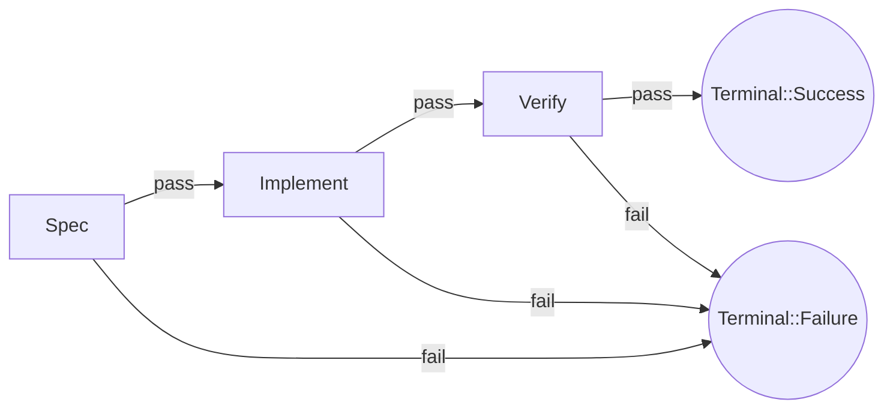
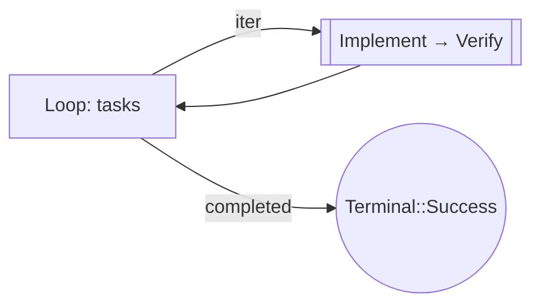
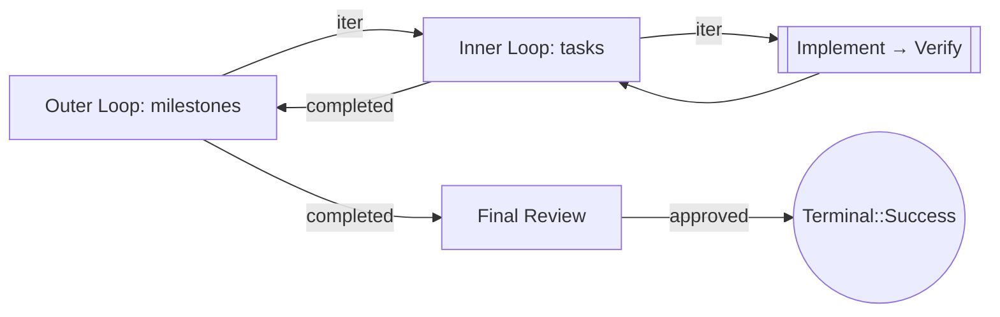
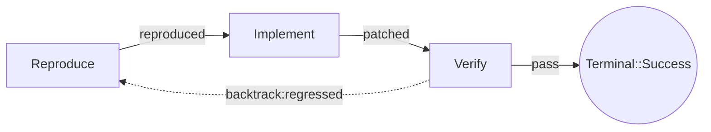
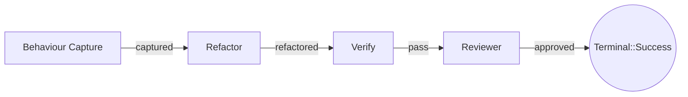
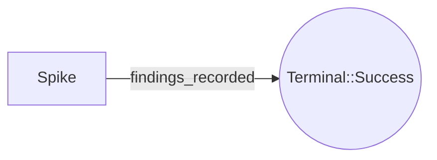

[← Hooks](hooks.md) · [Back to README](README.md) · [Architecture →](ARCHITECTURE.md)

# Archetype Gallery

Every shape Surge supports today, in copy-paste form. The bundled
TOML files live under [`examples/`](../examples/) and are validated
in CI by [`crates/surge-cli/tests/examples_smoke.rs`](../crates/surge-cli/tests/examples_smoke.rs).

| Archetype          | File                                            | When to use                                                              |
|--------------------|-------------------------------------------------|---------------------------------------------------------------------------|
| Terminal-only      | [`flow_terminal_only.toml`][f0]                  | Smoke-test the engine + persistence pipeline with no agent dependency.    |
| Minimal agent     | [`flow_minimal_agent.toml`][f1]                  | Single agent stage; smallest non-trivial run.                             |
| Linear-3          | [`flow_linear_3.toml`][f2]                       | Spec → Implement → Verify, with explicit success/failure terminals.       |
| Single loop       | [`flow_single_loop.toml`][f3]                    | Iterate a static collection through an `Implement → Verify` body.          |
| Multi-milestone   | [`flow_multi_milestone.toml`][f4]                | Outer milestone loop wrapping inner per-milestone task loops.             |
| Bug-fix           | [`flow_bug_fix.toml`][f5]                        | `Reproduce → Implement → Verify` with `regressed` Backtrack edge.         |
| Refactor          | [`flow_refactor.toml`][f6]                       | Capture behaviour first, then refactor under reviewer approval.           |
| Spike             | [`flow_spike.toml`][f7]                          | Two-node experiment that explicitly skips Architect / Reviewer.            |

[f0]: ../examples/flow_terminal_only.toml
[f1]: ../examples/flow_minimal_agent.toml
[f2]: ../examples/flow_linear_3.toml
[f3]: ../examples/flow_single_loop.toml
[f4]: ../examples/flow_multi_milestone.toml
[f5]: ../examples/flow_bug_fix.toml
[f6]: ../examples/flow_refactor.toml
[f7]: ../examples/flow_spike.toml

## Linear-3 — `Spec → Implement → Verify`

Three sequential agent stages, each with `pass`/`fail` outcomes. Every
`fail` escapes to a dedicated `failure` terminal so a single bad stage
is visible at the run-summary level.

## Single loop — body subgraph over a static list

Outer `Loop` node, body subgraph runs `Implement → Verify` per
iteration. Exits when `iterates_over` is exhausted.

## Multi-milestone — nested loops + final review

Outer milestone loop wraps an inner task loop. After every milestone
finishes, the outer loop advances; once all milestones complete, a
`final_review` agent gates the success terminal.

## Bug-fix — Backtrack on regression

`Verify` declares two outcomes — `pass` (forward) and `regressed`
(`kind = "backtrack"` edge to `Reproduce`). When the verifier discovers
the patch broke something, the run loops back through `Reproduce → Implement`
without escalating to a human.

The Backtrack edge has `policy.max_traversals = 3` so a stuck loop is
bounded — once exceeded, the engine escalates per `on_max_exceeded`.

## Refactor — behaviour-first

Captures the convention that a refactor must establish a behavioural
baseline before touching production code. The reviewer stage prevents
unbounded refactors from sneaking through verification alone.

## Spike — minimal experiment

Two-node experiment shape. The spike stage produces a
`findings_recorded` outcome only — there is no `pass`/`fail` distinction
because spikes are bounded by time, not correctness.

Use this when you need a deliberate detour from the regular pipeline
(reading docs, prototyping a library swap, benchmarking) and want the
event log to record the experiment without a verifier dragging the run
back through the rest of the chain.

## Adding new archetypes

1. Drop the `flow.toml` into [`examples/`](../examples/).
2. Add a `flow_<name>_validates` test to
   [`crates/surge-cli/tests/examples_smoke.rs`](../crates/surge-cli/tests/examples_smoke.rs)
   so CI catches schema drift.
3. Update this gallery table and add a mermaid diagram alongside.
4. If the archetype showcases hooks, document the hook recipe in
   [`docs/hooks.md`](hooks.md) too.

## See also

- [`docs/hooks.md`](hooks.md) — hook trigger lifecycle and matcher rules.
- [`docs/ARCHITECTURE.md`](ARCHITECTURE.md) — closed `NodeKind` enum, edge kinds.
- [`docs/workflow.md`](workflow.md) — adaptive flow generation and intake.
