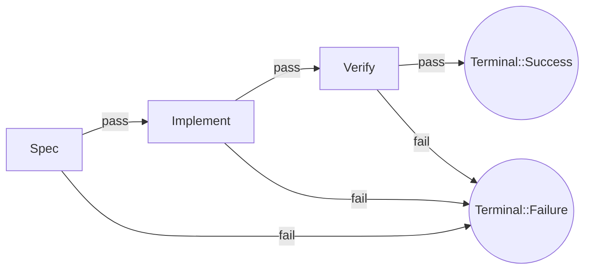
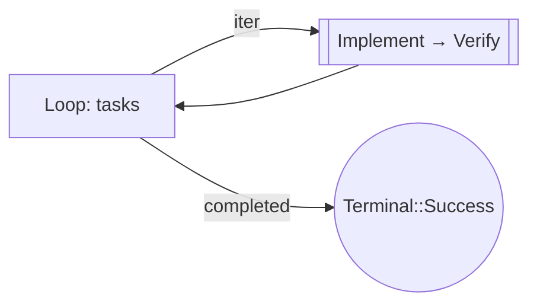
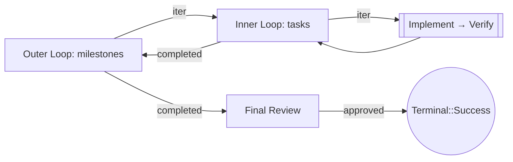
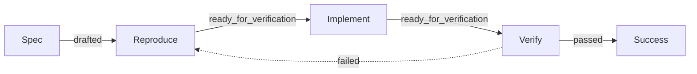
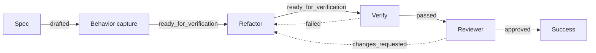
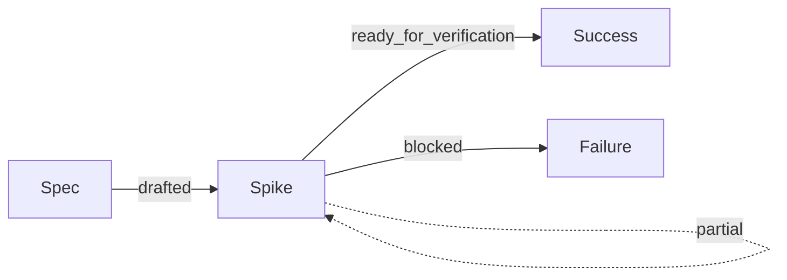

[← Hooks](hooks.md) · [Back to README](README.md) · [Architecture →](ARCHITECTURE.md)

# Archetype Gallery

Every shape Surge supports today, in copy-paste form. Reference examples
live under [`examples/`](../examples/); the first-party templates used by
`surge engine run --template <name>` are embedded from
[`crates/surge-core/bundled/flows/`](../crates/surge-core/bundled/flows/).

| Archetype          | File                                            | When to use                                                              |
|--------------------|-------------------------------------------------|---------------------------------------------------------------------------|
| Terminal-only      | [`flow_terminal_only.toml`][f0]                  | Smoke-test the engine + persistence pipeline with no agent dependency.    |
| Minimal agent     | [`flow_minimal_agent.toml`][f1]                  | Single agent stage; smallest non-trivial run.                             |
| Linear-3          | [`flow_linear_3.toml`][f2]                       | Spec → Implement → Verify, with explicit success/failure terminals.       |
| Single loop       | [`flow_single_loop.toml`][f3]                    | Iterate a static collection through an `Implement → Verify` body.          |
| Multi-milestone   | [`flow_multi_milestone.toml`][f4]                | Outer milestone loop wrapping inner per-milestone task loops.             |
| Bug-fix           | [`flow_bug_fix.toml`][f5]                        | Spec → Reproduce → Implement → Verify with bounded repair.         |
| Refactor          | [`flow_refactor.toml`][f6]                       | Capture behaviour first, then refactor under reviewer approval.           |
| Spike             | [`flow_spike.toml`][f7]                          | Spec → experiment; records findings without verification authority.            |

Run a bundled archetype directly:

```bash
surge engine run --template linear-3 --watch
```

[f0]: ../examples/flow_terminal_only.toml
[f1]: ../examples/flow_minimal_agent.toml
[f2]: ../examples/flow_linear_3.toml
[f3]: ../examples/flow_single_loop.toml
[f4]: ../examples/flow_multi_milestone.toml
[f5]: ../examples/flow_bug_fix.toml
[f6]: ../examples/flow_refactor.toml
[f7]: ../examples/flow_spike.toml

## Linear-3 — `Spec → Implement → Verify`

Three sequential agent stages, each with `pass`/`fail` outcomes. Every
`fail` escapes to a dedicated `failure` terminal so a single bad stage
is visible at the run-summary level.


```mermaid
flowchart LR
    Spec --> |pass| Impl[Implement]
    Impl --> |pass| Verify
    Verify --> |pass| Success((Terminal::Success))
    Spec --> |fail| Failure((Terminal::Failure))
    Impl --> |fail| Failure
    Verify --> |fail| Failure
```

## Single loop — body subgraph over a static list

Outer `Loop` node, body subgraph runs `Implement → Verify` per
iteration. Exits when `iterates_over` is exhausted.


```mermaid
flowchart LR
    Start[Loop: tasks] -->|iter| Body
    Body[[Implement → Verify]] --> Start
    Start -->|completed| End((Terminal::Success))
```

## Multi-milestone — nested loops + final review

Outer milestone loop wraps an inner task loop. After every milestone
finishes, the outer loop advances; once all milestones complete, a
`final_review` agent gates the success terminal.


```mermaid
flowchart LR
    Outer[Outer Loop: milestones] -->|iter| Inner
    Inner[Inner Loop: tasks] -->|iter| Body
    Body[[Implement → Verify]] --> Inner
    Inner -->|completed| Outer
    Outer -->|completed| Review[Final Review]
    Review -->|approved| End((Terminal::Success))
```

## Bug-fix — reproduce before patching

The spec author turns the initial request into `spec.toml`. Reproduction and
implementation receive this artifact explicitly. Reproduction writes
`reproduction.md`; the patch stage consumes those observations. The sealed
verifier checks the patch against the specification.


```mermaid
flowchart LR
    Spec -->|drafted| Reproduce
    Reproduce -->|ready_for_verification| Implement
    Implement -->|ready_for_verification| Verify
    Verify -->|passed| Success
    Verify -. failed .-> Reproduce
```

Failed verification returns to reproduction at most three times. Incomplete
implementation can retry at most three times; blocked work exits through the
failure terminal. Reproduction does not certify the patch.

## Refactor — preserve observed behavior

The spec precedes behavior capture. Capture produces `baseline.md` before
production changes. The implementer consumes that baseline and produces
`changes.patch`, including newly created files, for the reviewer. Both verifier
and reviewer receive the specification.


```mermaid
flowchart LR
    Spec -->|drafted| Capture[Behavior capture]
    Capture -->|ready_for_verification| Implement[Refactor]
    Implement -->|ready_for_verification| Verify
    Verify -->|passed| Reviewer
    Reviewer -->|approved| Success
    Verify -. failed .-> Implement
    Reviewer -. changes_requested .-> Implement
```

Repair and review loops have a three-traversal limit. A reviewer cannot approve
missing change evidence. A passing reviewer follows sealed verification.

## Spike — bounded experiment

The spec defines the hypothesis and acceptance criteria before the experiment.
The experiment produces `findings.md` with commands, observations, limitations,
and a recommendation. Success records completion of the experiment; it does
not emit a verified task transition.


```mermaid
flowchart LR
    Spec -->|drafted| Spike
    Spike -->|ready_for_verification| Success
    Spike -->|blocked| Failure
    Spike -. partial .-> Spike
```

The outcome name follows the implementer profile contract. This archetype has
no verifier; use a verified implementation flow before treating experimental
code as production-ready. Partial experiments may retry at most three times.

## Adding new archetypes

1. Drop the `flow.toml` into [`examples/`](../examples/).
2. Add a `flow_<name>_validates` test to
   [`crates/surge-cli/tests/examples_smoke.rs`](../crates/surge-cli/tests/examples_smoke.rs)
   so CI catches schema drift.
3. Update this gallery table and add a mermaid diagram alongside.
4. If the archetype showcases hooks, document the hook recipe in
   [`docs/hooks.md`](hooks.md) too.

## See also

- [`docs/hooks.md`](hooks.md) — hook trigger lifecycle and matcher rules.
- [`docs/ARCHITECTURE.md`](ARCHITECTURE.md) — closed `NodeKind` enum, edge kinds.
- [`docs/workflow.md`](workflow.md) — adaptive flow generation and intake.
