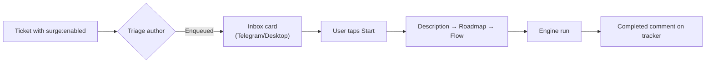
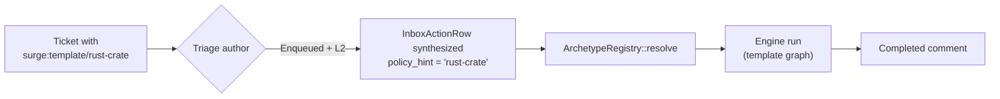
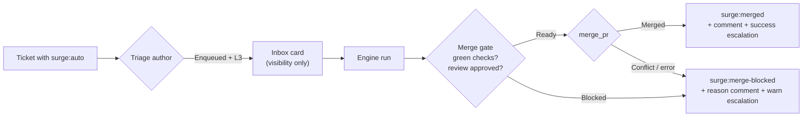

# Tracker automation

Surge can ingest tickets from external trackers (GitHub Issues, Linear) and
react with varying degrees of autonomy. The behaviour for each ticket is
selected by labels on the ticket itself — surge never writes status, only
labels and comments, so the user keeps authority over the ticket lifecycle.

This page is the operator reference: which labels do what, how decisions
flow, and how to inspect state.

> Decision record: [ADR 0013](adr/0013-tracker-automation-tiers.md).
> Source of truth: `surge_intake::policy::resolve_policy`.

## Tiers at a glance

| Tier | Label trigger | What surge does |
|------|---------------|-----------------|
| **L0** | `surge:disabled` _or_ no `surge:*` label | Surge ignores the ticket entirely — no triage, no LLM cost. The ticket is logged in `ticket_index` as `Skipped` with `triage_decision = "L0Skipped"` so `surge intake list` still shows the decision. |
| **L1** | `surge:enabled` | Full bootstrap. Triage author decides Enqueued / Duplicate / OOS / Unclear. Enqueued tickets produce an inbox card; the operator clicks Start to begin the Description → Roadmap → Flow bootstrap. **This is the default explicit opt-in.** |
| **L2** | `surge:template/<name>` | Skip bootstrap. The named template is resolved against the archetype registry and started directly. The inbox card is not shown — the run starts immediately on triage approval. Unknown template names degrade to L1 with a WARN log. |
| **L3** | `surge:auto` | Full automation. Identical to L1 for the bootstrap leg (the operator can still observe the card), but `RunFinished { Completed }` triggers the [merge gate](#l3-merge-gate). |

### Precedence

When more than one `surge:*` label is present, the most restrictive wins:

```
surge:disabled  >  surge:auto  >  surge:template/<name>  >  surge:enabled  >  (no label)
```

This is implemented as a single `match` in
[`surge_intake::policy::resolve_policy`](../crates/surge-intake/src/policy.rs).
Five proptests verify the table is total and deterministic.

## L1 — standard bootstrap

This is the default. Anything the LLM-driven triage decides goes through it.



Triage decisions land back on the tracker as a comment:

- **Enqueued** → inbox card delivered, awaiting user click.
- **Duplicate** → "Surge: detected duplicate of …" comment.
- **OutOfScope** → "Surge: out of scope. …" comment.
- **Unclear** → desktop notification (no tracker comment by default).

## L2 — template auto-start

Tag a ticket with `surge:template/<name>` where `<name>` matches a bundled or
user-authored archetype. The bootstrap three-stage is skipped entirely; the
template's graph is started directly.



If `<name>` does not resolve to any template (typo, deleted file), the launcher
falls back to L1 — a visible inbox card is delivered. A WARN line in the
daemon log records the unknown name; the ticket is not lost.

User templates live at `$SURGE_HOME/templates/<name>.toml` and shadow bundled
templates of the same name. See [archetypes.md](archetypes.md) for the
template format.

## L3 — full automation with merge gate

Tag a ticket with `surge:auto` to opt the run into post-completion auto-merge
consideration.



### L3 merge gate

After `RunFinished { Completed }`, the
[`AutomationMergeGate`](../crates/surge-daemon/src/automation_merge_gate.rs)
consumer:

1. Looks up the ticket via the run id.
2. Re-fetches the ticket's current labels (the user may have flipped
   `surge:auto` off mid-run).
3. Confirms the policy is still `Auto { merge_when_clean: true }`.
4. Calls `intake_emit_log::has(...)` to dedup against a re-fired event —
   a recorded `merged` row means a recovery re-emit can never double-merge.
5. Evaluates merge readiness via `TaskSource::check_merge_readiness`.
6. On `Ready`, executes the merge via `TaskSource::merge_pr`; on success
   posts a `surge:merged` comment + label and a **success** operator
   escalation. On `Blocked` — or a merge that returns a conflict / errors —
   posts a `surge:merge-blocked` comment + label and a **warn** escalation,
   so a stalled L3 run is never silent.
7. Records the terminal decision (`merged` or `merge_blocked`) in
   `intake_emit_log` so retries no-op. The `merged` row is written **before**
   the follow-up comment/label, because the merge is irreversible.

### GitHub readiness check

`TaskSource::check_merge_readiness` is implemented for GitHub via
[`octocrab`](https://docs.rs/octocrab/0.42). For an L3 ticket the gate:

1. Resolves the PR (MVP assumption: PR number equals issue number — the
   default surge workflow creates one PR per ticket in the same numbering
   sequence; multi-PR or branch-linked workflows are a follow-up).
2. Rejects terminal states up front: already merged, draft, or not open.
3. Inspects `mergeable_state`: only `Clean` and `HasHooks` proceed.
   `Behind`, `Blocked`, `Dirty`, `Unstable`, `Draft`, and `Unknown` each
   produce a specific `Blocked(reason)`.
4. Lists reviews and keeps the latest non-comment review per author.
   At least one current `APPROVED` is required; any current
   `CHANGES_REQUESTED` blocks.

Linear (and any other PR-less provider) inherits the trait default that
returns `Blocked("provider does not implement merge readiness checks")`,
so L3 runs against them never silently fall through.

The `Ready` verdict carries the **head SHA** it was computed against. The
gate passes that SHA back to `merge_pr`, which pins the GitHub merge to it
(`merge(...).sha(head)`). If a push lands between the readiness check and the
merge, GitHub returns `409` and the gate escalates instead of merging the new,
unreviewed head — closing the check-to-merge race on an irreversible action.

### Executing the merge

When readiness is `Ready`, the gate calls `TaskSource::merge_pr`, which for
GitHub issues `octocrab.pulls().merge(number)` with the repo's configured
merge method:

```toml
[[task_sources]]
type = "github_issues"
id = "github-myapp"
repo = "user/myapp"
api_token_env = "GITHUB_TOKEN"
merge_method = "squash"   # squash (default) | merge | rebase
```

`merge_method` defaults to `squash` (linear history, the common convention).
The merge returns one of:

- `Merged` / `AlreadyMerged` → `surge:merged` + success escalation.
- `Conflict(reason)` (GitHub `405` / `409` / `422` — head moved, conflicts,
  or required state regressed between the readiness check and the merge) →
  `surge:merge-blocked` + warn escalation. A genuine transport error is
  surfaced the same way. The merge is never retried silently.

PR-less providers keep the trait-default `merge_pr`, which errors; they never
reach this path because their readiness stays `Blocked`.

> **Still deferred to the next M2 task.** `CadenceController` is wired into
> diagnostics but not yet into the source poll loops — see the priority-label
> section below and ADR 0013 § "Tier-aware polling".

## Priority labels

The label `surge-priority/<level>` is honoured independently of the tier
label. Recognized levels: `urgent`, `high`, `medium`, `low`. Priority affects:

- Inbox-card sort order.
- (Future) `CadenceController` polling pace — the algorithm exists in
  [`surge_intake::cadence`](../crates/surge-intake/src/cadence.rs) with the
  tier-aware interval table (L1 = 5 min, L2 = 2 min, L3 = 1 min,
  exponential backoff on rate-limit). Production wiring of the controller
  into the source poll loops is staged in a follow-up — see ADR 0013
  § "Tier-aware polling" for the deferred-work note.

## External state changes (ticket-as-master)

Surge follows the tracker's lead. When the tracker reports a non-`NewTask`
event, the `TaskRouter` forwards it as `RouterOutput::ExternalUpdate` and the
daemon reflects it into the FSM:

| Event | Surge response |
|-------|----------------|
| `TaskClosed` | If a run is active, call `EngineFacade::stop_run(run_id, "closed externally")` and transition the `ticket_index` row to `Aborted`. If a card is awaiting decision, clear the callback token and transition to `Skipped` with `triage_decision = "ExternallyClosed"`. |
| `StatusChanged { to: "closed" }` | Same as `TaskClosed`. |
| `LabelsChanged { added: ["surge:disabled"] }` | Mid-run graceful abort via the same close path. |
| Other `LabelsChanged` (incl. `surge:auto` mid-run) | INFO-log only; operator must restart the run to change tier. |
| Other `StatusChanged` | INFO-log only; no FSM action. |

Terminal-state tickets (`Completed`, `Failed`, `Aborted`, `Skipped`,
`Stale`, `TriageStale`) are no-ops — surge never "un-closes" a ticket.

## Inspecting state

### `surge intake list`

```bash
surge intake list
surge intake list --tracker github_issues:org/repo
surge intake list --format json | jq '.[] | select(.state == "Active")'
surge intake list --limit 200
```

Renders the `ticket_index` table, newest first. Columns:

- `SOURCE` — `source_id` from `surge.toml`.
- `TASK` — provider-prefixed task id (e.g. `github_issues:org/repo#42`).
- `STATE` — FSM state (`Seen`, `Triaged`, `InboxNotified`, `RunStarted`,
  `Active`, `Completed`, `Failed`, `Aborted`, `Skipped`, etc.).
- `PRIO` — priority from triage (or `-`).
- `RUN` — run id if a run was spawned (or `-`).
- `LAST SEEN` — ISO-8601 timestamp.

The JSON format is stable; field names will not change without a major-version
bump (see [ADR 0013](adr/0013-tracker-automation-tiers.md)).

### `surge tracker list` / `surge tracker test`

Reports configuration only — what's in `surge.toml`, and whether the source
is reachable. See [cli.md](cli.md).

## Idempotency

Every outbound side-effect goes through `intake_emit_log` keyed by
`(source_id, task_id, event_kind, run_id)`:

- `triage_decision` (the inbox-card / duplicate-comment emission)
- `run_started` / `run_completed` / `run_failed` / `run_aborted`
- `merged` (terminal success — prevents a double-merge on a re-fired
  completion) / `merge_blocked` / `merge_proposed` (legacy, no longer written)

A retried `RunFinished` event (e.g. after daemon restart) cannot
double-post a comment or double-label the ticket. The per-source
idempotency layer (GitHub exact-body match, Linear idempotency keys)
remains in place; the emit log is the additional safety net across
daemon restarts and across delivery channels.

## Configuration reference

In `surge.toml`:

```toml
[[task_sources]]
type = "github_issues"
id = "github_issues:org/repo"
repo = "org/repo"
api_token_env = "GITHUB_TOKEN"
poll_interval = "5min"
label_filters = ["surge:enabled", "surge:auto", "surge:template/*"]
```

`label_filters` is provider-side filtering and is independent of
`AutomationPolicy` — surge will still ignore tickets that pass the filter if
their labels resolve to `Disabled`.

## See also

- [ADR 0013 — Tracker automation tiers](adr/0013-tracker-automation-tiers.md)
- [ADR 0005 — Archetype catalog](adr/0005-archetype-catalog.md)
- [archetypes.md](archetypes.md) — template authoring
- [cli.md](cli.md) — every CLI subcommand
- [workflow.md](workflow.md) — end-to-end run flow
- [ARCHITECTURE.md § Tracker is master](ARCHITECTURE.md)
