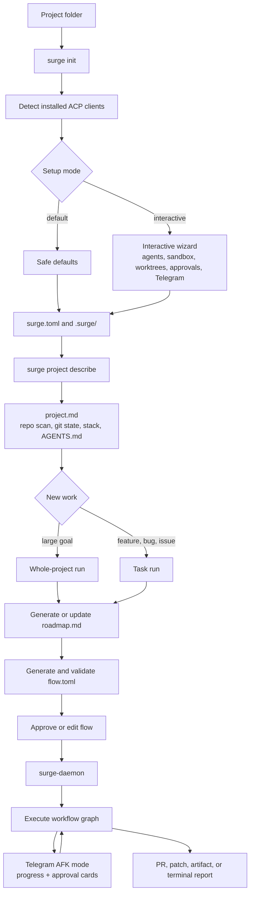
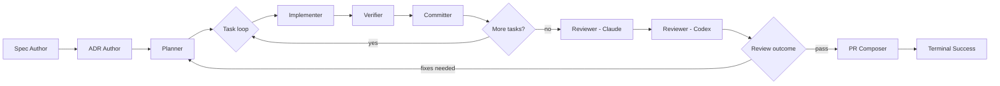
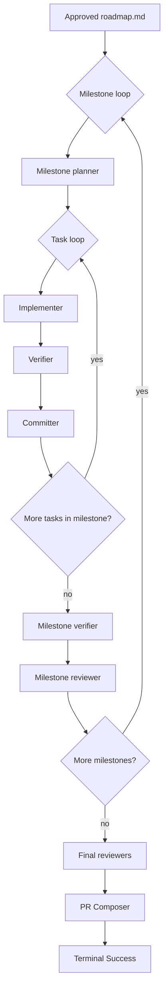
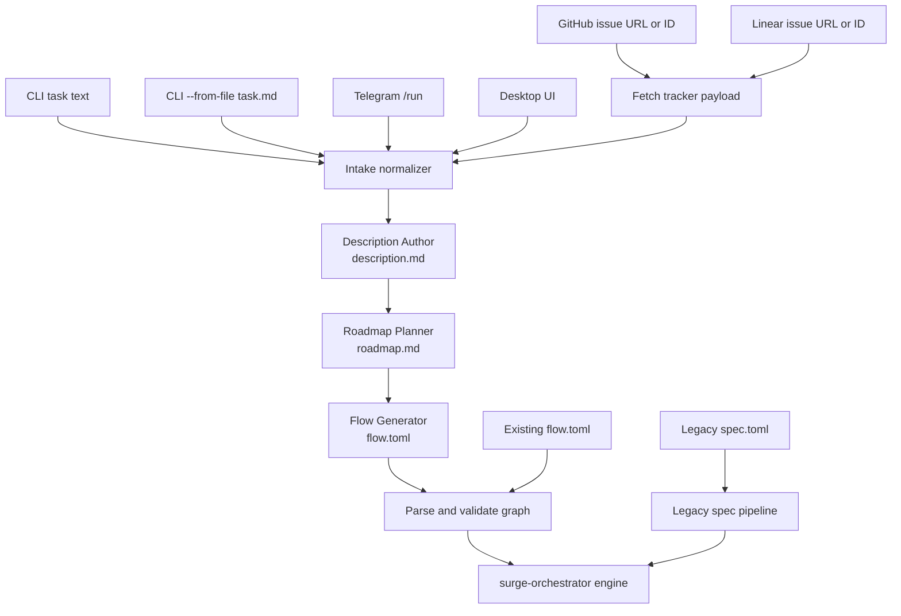
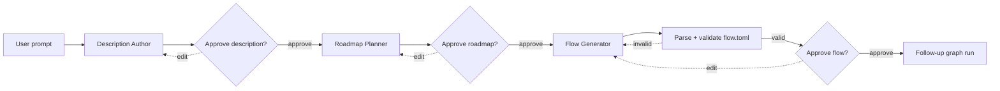
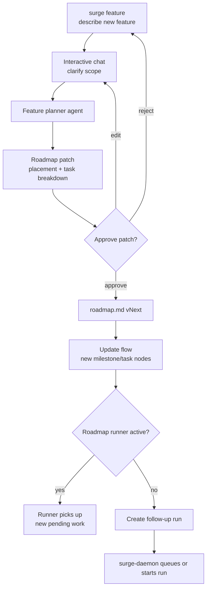
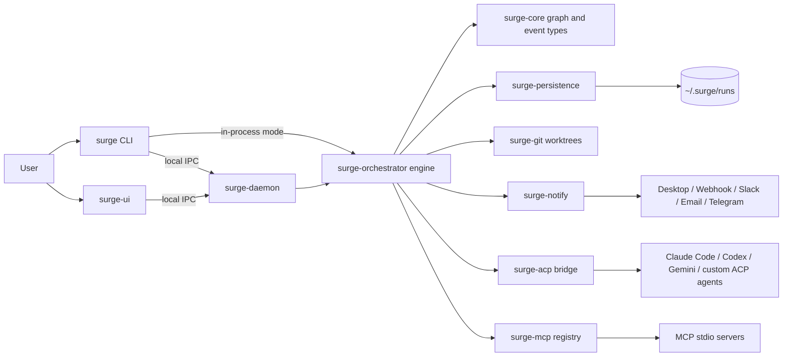
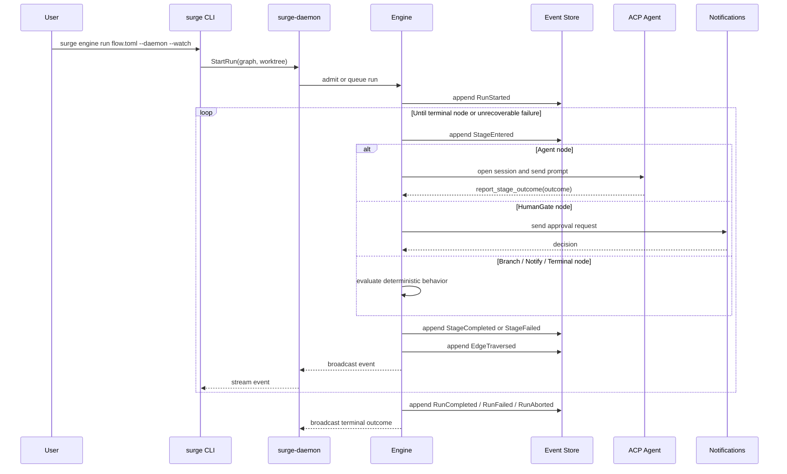

[← CLI](cli.md) · [Back to README](../README.md) · [Architecture →](ARCHITECTURE.md)

# Workflow

This page describes the AFK ("away-from-keyboard") workflow as it appears to a user: how a project is initialized, how work is intaked from various sources, how runs are bootstrapped into a `flow.toml` graph, and how the runtime executes that graph. For the architectural rationale behind every piece, see [`ARCHITECTURE.md`](ARCHITECTURE.md).

> **Documentation convention.** **Current** means implemented enough to try from the repository. **Target** means product direction from `docs/`; command names may still change while the CLI is being aligned.

## Target AFK Workflow

Surge is project-first. A user creates or opens a project folder, runs `surge init`, lets Surge detect available ACP clients, chooses default or interactive setup, then runs whole-project or task-level work. The daemon owns execution; Telegram and the desktop UI are monitoring and approval surfaces.

The AFK part is explicit: the local machine keeps executing while the user only handles strategic decisions, such as approving generated plans, granting a permission, answering a HumanGate, or reviewing the final PR.

## Flow Model

A `flow.toml` is a workflow graph. Each node is a bounded stage with its own:

- role / profile
- provider / client: Claude, Codex, Gemini, Copilot, or custom ACP
- sandbox intent and tool access
- input bindings from prior artifacts
- retry and timeout policy
- declared outcomes

Each Agent node runs in a **SMART Zone**:

- **Scope** — what this node owns.
- **Model** — which ACP client / provider runs it.
- **Access** — sandbox intent, MCP tools, filesystem / network policy.
- **Runtime context** — project description, roadmap item, prior artifacts, selected files, graph metadata.
- **Termination contract** — the node must report a declared outcome.

Agents understand the local flow context and choose an outcome, but routing is still graph data. If a step needs judgment, that judgment is modeled as outcome ports such as `pass`, `fixes_needed`, `architecture_issue`, `security_blocker`, or `escalate`.

### Example Feature Flow

This is one possible medium feature flow. The Flow Generator can add or remove nodes based on risk, scope, project type, and available profiles.

### Roadmap Flow

For a roadmap-driven run, the graph can contain nested loops: an outer loop over milestones and an inner loop over tasks inside the active milestone.

Each loop body is still made of normal nodes with normal outcomes. A verifier can route back to implementation for a local fix. A milestone reviewer can route back to planning if the milestone is structurally wrong. Final reviewers can route back before PR creation.

## Intake Sources

All incoming work should be normalized before bootstrap. A GitHub issue or Linear issue is not a special pipeline type; it is another source of task text and metadata.

Current practical paths:

- `surge init --default` writes safe project defaults; `surge init` runs the interactive setup/edit wizard.
- `surge project describe` creates or refreshes `project.md`, the stable project summary captured into new runs as the `project_context` artifact.
- `surge bootstrap "<prompt>"` starts from free-form work, generates `description.md`, `roadmap.md`, and `flow.toml`, then launches the materialized follow-up graph.
- `surge engine run <flow.toml>` starts from an already-authored graph.
- `surge engine run --template <name>` starts from a bundled or user archetype template and skips bootstrap.
- `surge run <spec_id>` uses the older spec pipeline.

Target paths:

- CLI / Telegram / UI natural-language work enters the bootstrap path.
- GitHub Issues and Linear issues are fetched, normalized, and fed into the same bootstrap path.

## Current Bootstrap Implementation

The implemented bootstrap path is a graph like any other graph. The bundled
`bootstrap` flow runs three authoring agents with HumanGates between them:

`edit` decisions append `BootstrapEditRequested` and backtrack to the preceding
agent with the latest feedback bound as `edit_feedback`. The default cap is
three edits per bootstrap stage; exceeding it emits `EscalationRequested` and
fails the run. Flow Generator output also passes through the graph validator
before the flow gate appears, so invalid `flow.toml` output is retried without
asking the user to approve a broken graph.

After approval, the bootstrap driver extracts the latest `description`,
`roadmap`, and `flow` artifacts, appends `BootstrapTelemetry`, and starts the
follow-up run with those artifacts inherited through the content-addressed
artifact store. If `project.md` exists, its current content is captured at the
same run boundary as `project_context`; later edits to `project.md` affect only
future runs, not replay or resume of the current run.

## Roadmap Amendments

Roadmaps are not frozen documents. After roadmap approval, the user can add a feature through a target `surge feature` flow. The feature planner proposes a patch: where to insert the feature and how to expand it into milestone / tasks.

If a roadmap runner is active, the daemon can emit a roadmap-updated event and the runner sees the new pending milestone / tasks. If the roadmap is already terminal, or roadmap-flow execution is disabled, Surge appends the feature and creates a follow-up run instead of mutating completed execution history.

## Runtime Architecture

The daemon is the local coordinator. It accepts work from CLI, Telegram, UI, and eventually external trackers, then starts or queues runs. Progress and approval state are derived from the event log, so Telegram messages and the desktop UI render the same underlying state.

## Run Lifecycle

Every state transition is persisted first and rendered later. Replaying a run is a fold over the event stream.

## See Also

- [CLI](cli.md) — concrete commands that drive the workflow today
- [Architecture](ARCHITECTURE.md) — the underlying engine, event log, ACP bridge, and crate layout
- [Getting Started](getting-started.md) — install and run a small flow end-to-end
